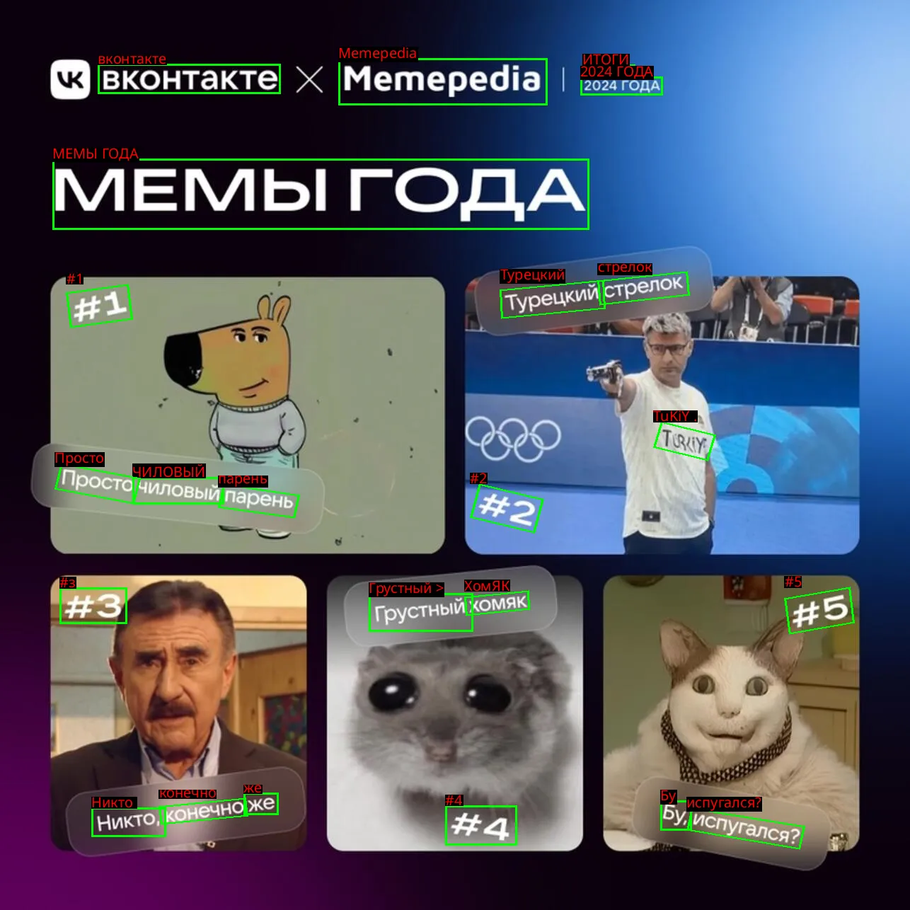

# Сервис распознавания текста (OCR)
Сервис находится по пути: `./services/text-detection`

Это веб-сервис для извлечения текста с изображений. Он предоставляет удобный интерфейс (Gradio), где можно загрузить картинку и получить распознанный текст с выделением областей на изображении.

## Возможности

Поддерживаются две модели распознавания:

1.  **Qwen-VL (VLM)** — мощная мультимодальная нейросеть. Отлично понимает контекст и сложные сцены, но требует видеокарту (GPU) с объемом памяти от 12 ГБ.
2.  **EasyOCR (Fine-Tuned)** — легковесная модель, дообученная специально для этого проекта (поддержка кириллицы и латиницы). Работает быстрее и потребляет меньше ресурсов.

---

## Подготовка к запуску

Перед запуском убедитесь, что все необходимые файлы моделей и шрифтов находятся на своих местах внутри папки `src/api/`.

### 1. Файлы моделей EasyOCR
Для работы режима `EasyOCR (Fine-Tuned)` необходимо наличие весов модели.
Положите файлы `craft_mlt_25k.pth` (детектор) и `cyrillic_g2.pth` (распознавание) в папку:
`src/api/models/easyocr_finetuned/`

### 2. Шрифт
Для корректного отображения русского текста на картинках требуется файл шрифта.
Положите файл `NotoSans-Regular.ttf` в папку:
`src/api/`

*(Модель Qwen-VL скачается автоматически при первом запуске)*

---

## Запуск через Docker (Рекомендуется)

Это самый простой способ запуска, так как все системные библиотеки уже настроены.

**Требования:** Установленный Docker и NVIDIA Container Toolkit (для поддержки GPU).

1. **Сборка образа**
   Находясь в папке `services/text-detection`, выполните:
   ```bash
   docker build -t ocr-service .
   ```

2. **Запуск контейнера**
   ```bash
   docker run -d \
     --gpus all \
     -p 7860:7860 \
     --name ocr-container \
     ocr-service
   ```

3. **Использование**
   Откройте браузер и перейдите по адресу: [http://localhost:7860](http://localhost:7860)

---

## Локальный запуск (для разработки)

Если вы хотите запустить проект без Docker, вам понадобится Python 3.10+.

1. **Создание виртуального окружения:**
   ```bash
   python -m venv venv
   source venv/bin/activate  # Для Linux/macOS
   # venv\Scripts\activate   # Для Windows
   ```

2. **Установка зависимостей:**
   ```bash
   pip install -r requirements.txt
   ```

3. **Запуск:**
   Перейдите в папку с исходным кодом API и запустите скрипт:
   ```bash
   cd src/api
   python ocr.py
   ```
   Сервис будет доступен по адресу: `http://127.0.0.1:7860`

---

## Как пользоваться

1. Откройте веб-интерфейс в браузере.
2. В поле **"Upload Image"** загрузите изображение (перетащите файл или кликните для выбора).
3. В выпадающем списке **"Choose Model"** выберите модель:
   - *Qwen-VL (VLM)* — для сложных изображений и рукописного текста.
   - *EasyOCR (Fine-Tuned)* — для сканов документов, вывесок и четкого печатного текста.
4. Нажмите кнопку **"Recognize Text"**.
5. Через несколько секунд справа появится изображение с обведенным текстом, а в поле снизу — распознанный текст.

## Пример 
[](services/text-detection/presentation/1.mp4)